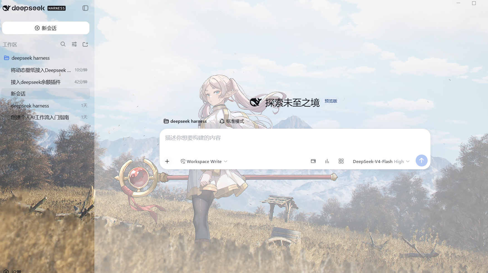
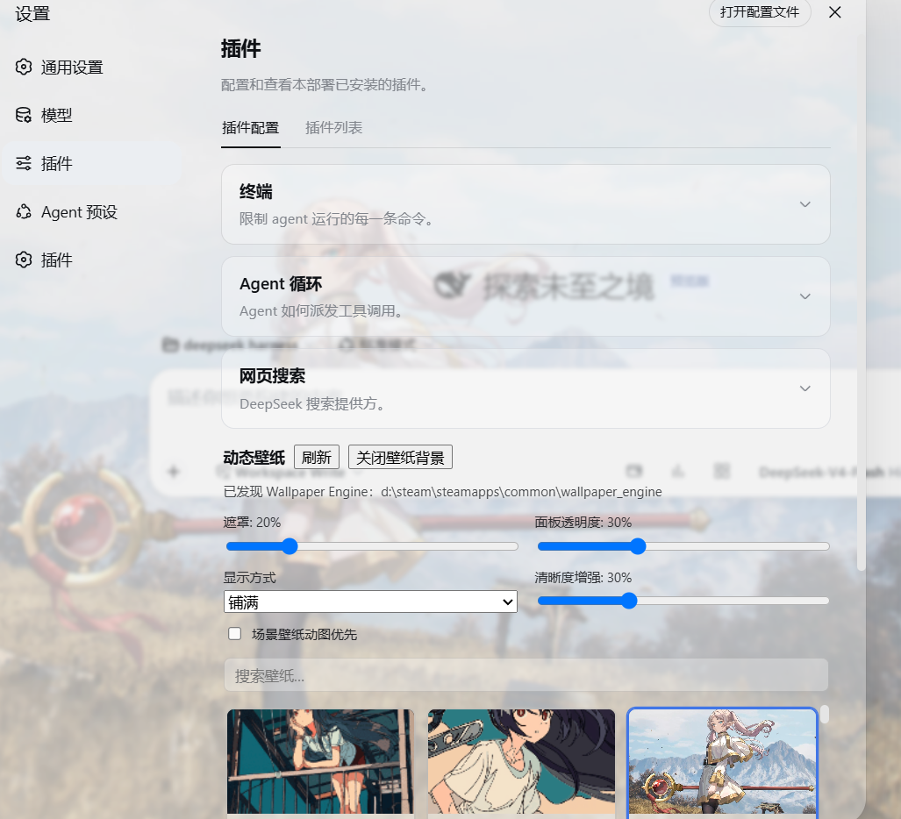

# dsh-we-wallpaper

把你的 [Wallpaper Engine](https://store.steampowered.com/app/431960) 壁纸库变成
[DeepSeek Harness](https://github.com/deepseek-ai/DeepSeek-Harness) Web GUI 的背景——
**视频壁纸直接播放、网页壁纸直接渲染、场景壁纸从 `.pkg` 包中解码出原始高清贴图**。
热插拔、无外部依赖、不改任何 dsh 源码。

- 语言: [English](README.md)

## 演示 / Screenshots

设置卡片与应用到界面背景的场景壁纸：





## 特性

- **把动态壁纸渲染为 GUI 背景**
  - `video` 视频壁纸以循环静音 `<video>` 播放（原生分辨率）
  - `web` 网页壁纸以沙箱化、穿透点击的 `<iframe>` 渲染
  - `image` 图片壁纸直接显示
  - `scene` 场景 / `application` 程序壁纸显示**从 `scene.pkg` 解码出的背景贴图**——
    仓库内置、零依赖的 WE 包格式解码器（内嵌 PNG/JPEG、LZ4 mipmap、
    DXT1/3/5、RGBA8888），多数场景直接呈现 4K–8K 原图，取代 150–256px 的
    模糊预览 GIF
- **设置卡片**（官方「设置 → 插件配置」区）：实时预览浏览壁纸库、搜索、一键应用，
  并标注当前正在桌面运行的壁纸
- **可读性控制**：深色*遮罩*、*面板透明度*（官方表面 token 重声明为半透明——
  亮/暗主题均生效）、*铺满/完整* 显示方式、*清晰度增强*（SVG 卷积锐化，用于
  回退动图源）、以及「*场景壁纸动图优先*」开关
- **资源友好的播放**：壁纸不变时媒体元素复用——拖动滑杆绝不重启视频流或叠加
  解码管线（已修复此处导致的内存泄漏崩溃）
- **选择持久化**在 `~/.dsh/we-wallpaper.json`；场景贴图提取结果缓存在
  `~/.dsh/we-wallpaper-cache/`

## 快速开始

```sh
# 在本仓库目录
dsh plugin --profile web add <路径或git地址>
# 或从已发布仓库：
# dsh plugin --profile web add https://github.com/pbadgpmeb22791-sketch/dsh-we-wallpaper
```

重启（或热重载）dsh 宿主并刷新 GUI 页面，打开 **设置 → 插件配置 → 动态壁纸**，
选中壁纸，按喜好调节遮罩与面板透明度。

所有安装路径（含手动改 `cordis.patch.yml`、dsh-super-injector）见
[docs/INSTALL.md](docs/INSTALL.md)；全部选项与故障排查见
[docs/USAGE.md](docs/USAGE.md)。

## 工作原理

| 半区 | 文件 | 职责 |
| --- | --- | --- |
| Host | `src/we-scanner.ts` | 发现 WE 安装（env → Steam 注册表 → `libraryfolders.vdf` → 常见路径）并解析每个 `project.json` |
| Host | `src/pkg-tex.ts` | WE 包解码器：目录表、TEXV/TEXB 容器、LZ4、DXT1/3/5、内嵌 PNG/JPEG、PNG 编码 |
| Host | `src/pkg-preview.ts` | 提取缓存（`~/.dsh/we-wallpaper-cache/`） |
| Host | `src/routes.ts` | `/api/we-wallpaper/*` 路由族——同源栅栏 + 路径穿越防护 |
| Host | `src/state.ts` | 选择持久化（`~/.dsh/we-wallpaper.json`） |
| 浏览器 | `src/client/layer.ts` | 固定背景层：按类型渲染媒体、token 快照半透明、遮罩、锐化 |
| 浏览器 | `src/client/WallpaperCard.tsx` | 壁纸库卡片（预览、搜索、应用、选项） |

### HTTP API

| 路由 | 用途 |
| --- | --- |
| `GET  /api/we-wallpaper/list` | 壁纸库（id/标题/类型/来源/桌面使用中） |
| `GET/POST /api/we-wallpaper/state` | 选择与选项持久化 |
| `GET  /api/we-wallpaper/preview/<id>` | 本地预览文件（GIF/JPG/PNG） |
| `GET  /api/we-wallpaper/pkg/<id>` | 提取的场景背景（PNG/JPEG，带缓存） |
| `GET  /api/we-wallpaper/media/<id>` | 主媒体文件（支持 Range 的视频流） |
| `GET  /api/we-wallpaper/web/<id>/<path>` | 网页壁纸静态文件 |

## 安全说明

- 所有路由拒绝跨站请求（`Sec-Fetch-Site` / `Origin` 栅栏）——任意网页无法通过
  localhost CSRF 读取你的壁纸库
- 壁纸 id 只做扫描表查找；网页文件路径有穿越防护
- 网页壁纸运行在沙箱化、穿透点击的 iframe 中——它们仍是**你自己的本地文件**，
  请像在 Wallpaper Engine 中一样信任创意工坊内容
- 场景/程序壁纸永不执行，只解码其贴图

## 已知限制

- 场景背景是**静态图**：显示包中最大的横版贴图——粒子、着色器与动画无法在
  浏览器中重渲染。极老包版本（PKGV0002 时代）与少量特殊贴图回退到本地动图
- 背景选择启发式（最大面积 × 16:9 宽高比评分）在极少数壁纸上可能选中横版
  角色/前景贴图而非真正背景（见 [docs/SUMMARY.md](docs/SUMMARY.md)）
- 音频静音（浏览器自动播放策略）
- 半透明重映射覆盖官方 `--dsw-alias-*` token；自带硬编码背景的第三方插件
  可能仍然不透明

## 求助 / Help wanted

作者自述（也是本项目尚未完全解决的问题，欢迎有能力的人接手）：

> 我目前能做的 wallpaper engine 中动态壁纸格式是**视频文件**的才可以顺利作为
> dsh 的壁纸；还有一种格式是 `.pkg` 加密格式，我尝试过 GitHub 上的 pkg 格式
> 提取器，但是还是失败了，选择这种格式的壁纸的时候会显示失败。我本人是个
> 业余的人员，只是尝试使用 agent 做一些想做的事情，如果有人会做的话，可以
> 尝试做一下，谢谢了。

补充现状：本插件内置了零依赖的 `scene.pkg` 解码器（`src/pkg-tex.ts`），已覆盖
大部分创意工坊场景——40 个采样场景实测 98% 提取成功（大量 4K–8K 原图）。
仍然失败的：极老包版本（PKGV0002 时代，条目名与数据错位）与少量特殊贴图容器
（这些会回退到本地动图）。如果你了解 WE 包/tex 格式的剩余细节，欢迎对
`src/pkg-tex.ts` 提 PR。复现资料见
[scripts/probe-pkg.mjs](scripts/probe-pkg.mjs) 与
[docs/SUMMARY.md](docs/SUMMARY.md)。

## 路线图

见 [docs/SUMMARY.md](docs/SUMMARY.md)——scene.json 材质图精确选背景、
PKGV0002 时代包支持、可选多层合成、npm 发布。

## 开发

```sh
npm install
npm run typecheck   # tsc 检查 host + client 两套 program
npm test            # vitest（pkg 解码器、LZ4、DXT、缓存、扫描器）
npm run build       # lib/index.js（host）+ lib/client.js（浏览器 bundle）
```

诊断脚本在 `scripts/`（`probe-pkg.mjs`、`probe-previews.mjs`、
`survey-extract.mjs`）。详见 [docs/DEVELOPMENT.md](docs/DEVELOPMENT.md)。

## 许可证

MIT——DXT 解码包含 [RePKG](https://github.com/notscuffed/repkg)（Xalcon @
mmowned.com）中 LibSquish 衍生 MIT 代码的 TypeScript 移植。
